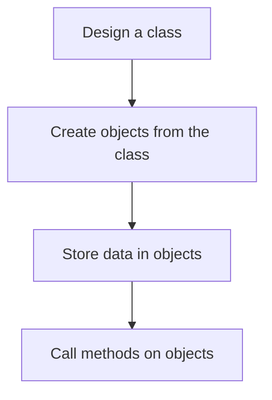
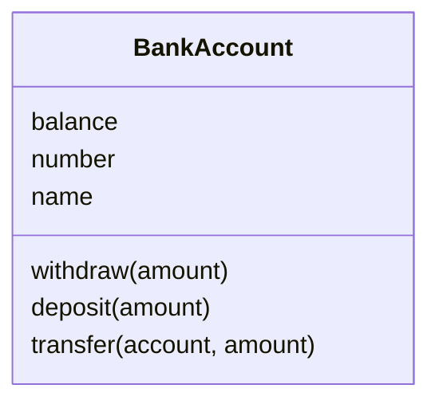
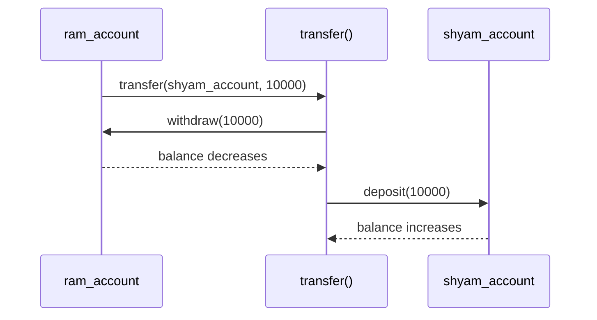
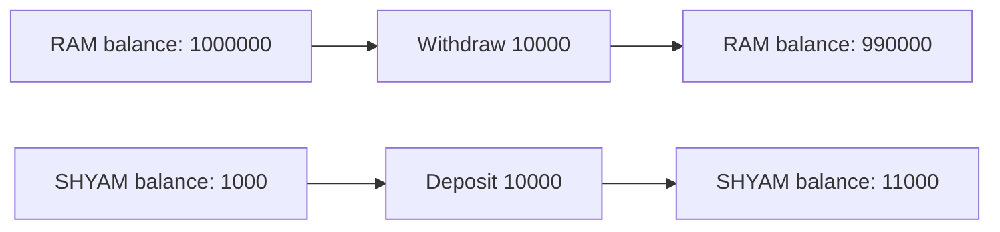
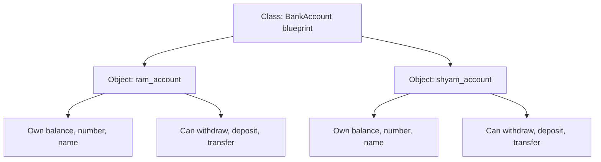

# Basic OOP and Poor Bank Example

This note explains the ideas from `basic_oop.ipynb` and connects them with the working example in `poor_bank/main.py`.

## 1. What Is OOP?

OOP means **Object Oriented Programming**.

In OOP, we think about programs using real-world objects.

Example:

A bank account is a real-world object.

It has:

- **Data**: account number, balance, customer name
- **Actions**: deposit money, withdraw money, transfer money

In Python:

- Data is stored using **attributes**
- Actions are written using **methods**

## 2. Class and Object

### Class

A **class** is a blueprint or design.

It tells Python what kind of data and actions an object should have.

Example:

```python
class BankAccount:
    pass
```

This says: "I am creating a design called `BankAccount`."

### Object

An **object** is a real thing created from a class.

Example:

```python
ram_account = BankAccount()
```

Here:

- `BankAccount` is the class
- `ram_account` is an object of that class

## 3. Basic OOP Flow



Simple meaning:

1. First create a class.
2. Then create objects from that class.
3. Each object can have its own data.
4. Use methods to work with that data.

## 4. Naming Conventions

Good naming makes code easier to read.

| Element | Convention | Example |
| --- | --- | --- |
| Class | PascalCase | `BankAccount` |
| Variable | snake_case | `user_name` |
| Method | snake_case | `withdraw_money()` |
| Function | snake_case | `calculate_sum()` |
| Constant | UPPER_CASE | `MAX_LIMIT` |
| Module/File | lowercase | `main.py` |
| Package/Folder | lowercase | `poor_bank/` |

## 5. Attributes and Methods

For a bank account:

### Attributes

Attributes are the values stored inside an object.

Example attributes:

- `balance`
- `number`
- `name`

### Methods

Methods are functions written inside a class.

Example methods:

- `withdraw()`
- `deposit()`
- `transfer()`



## 6. Instance Level Members

Instance level means **object level**.

Each object has its own copy of the data.

Example from `main.py`:

```python
ram_account = BankAccount(balance=1000000, number="99999", name="RAM")
shyam_account = BankAccount(balance=1000, number="11111", name="SHYAM")
```

Here, both objects are created from the same class, but their data is different.

| Object | Balance | Number | Name |
| --- | ---: | --- | --- |
| `ram_account` | `1000000` | `"99999"` | `"RAM"` |
| `shyam_account` | `1000` | `"11111"` | `"SHYAM"` |

## 7. Constructor: `__init__`

The constructor runs automatically when an object is created.

In `main.py`:

```python
def __init__(self, balance: float, number: str, name: str):
    self.balance = balance
    self.number = number
    self.name = name
```

When this line runs:

```python
ram_account = BankAccount(balance=1000000, number="99999", name="RAM")
```

Python calls `__init__()` and stores:

```python
self.balance = 1000000
self.number = "99999"
self.name = "RAM"
```

So `ram_account` now has its own balance, number, and name.

## 8. What Is `self`?

`self` means **the current object**.

When we write:

```python
ram_account.withdraw(10000)
```

Python understands it like:

```python
BankAccount.withdraw(ram_account, 10000)
```

So inside the method:

```python
def withdraw(self, amount):
    self.balance -= amount
```

`self` points to `ram_account`.

That means:

```python
ram_account.balance -= 10000
```

## 9. Instance Methods

Instance methods work on a specific object.

They usually take `self` as the first parameter.

### Withdraw

```python
def withdraw(self, amount: float):
    self.balance -= amount
```

Meaning:

- Take money from the current account.
- Reduce the current account balance.

Example:

```python
ram_account.withdraw(10000)
```

### Deposit

```python
def deposit(self, amount: float):
    self.balance += amount
```

Meaning:

- Add money to the current account.
- Increase the current account balance.

Example:

```python
shyam_account.deposit(10000)
```

### Transfer

```python
def transfer(self, account, amount: float):
    self.withdraw(amount)
    account.deposit(amount)
```

Meaning:

- Withdraw money from the current account.
- Deposit the same money into another account.

## 10. Transfer Flow in `main.py`

Code:

```python
ram_account.transfer(shyam_account, 10000)
```

Meaning:

- `ram_account` is sending money.
- `shyam_account` is receiving money.
- `10000` is the transfer amount.



## 11. Balance Before and After Transfer

Before transfer:

| Account | Balance |
| --- | ---: |
| RAM | `1000000` |
| SHYAM | `1000` |

Transfer:

```python
ram_account.transfer(shyam_account, 10000)
```

After transfer:

| Account | Calculation | Final Balance |
| --- | --- | ---: |
| RAM | `1000000 - 10000` | `990000` |
| SHYAM | `1000 + 10000` | `11000` |



## 12. Complete `main.py` Explanation

```python
class BankAccount:
```

Creates a class named `BankAccount`.

```python
def __init__(self, balance: float, number: str, name: str):
```

Defines the constructor. It receives starting balance, account number, and account holder name.

```python
self.balance = balance
self.number = number
self.name = name
```

Stores the received values inside the object.

```python
def withdraw(self, amount: float):
    self.balance -= amount
```

Subtracts money from the current account.

```python
def deposit(self, amount: float):
    self.balance += amount
```

Adds money to the current account.

```python
def transfer(self, account, amount: float):
    self.withdraw(amount)
    account.deposit(amount)
```

Moves money from the current account to another account.

```python
if __name__ == "__main__":
```

This block runs only when we run this file directly.

It does not run automatically if another file imports this file.

## 13. Class Level vs Instance Level

### Class Level

Class level data belongs to the class itself.

Example from the notebook:

```python
class NewBankAccount:
    bank_name: str = "HDFC"
```

We can access it using:

```python
NewBankAccount.bank_name
```

Useful when the value is common for all objects.

Example:

- Bank name
- IFSC branch prefix
- App version

### Instance Level

Instance level data belongs to each object.

Example:

```python
def __init__(self, balance, account_number, customer_name):
    self.balance = balance
    self.account_number = account_number
    self.customer_name = customer_name
```

Useful when the value is different for every object.

Example:

- Account balance
- Account number
- Customer name

## 14. Class Method vs Instance Method

### Class Method

A class method belongs to the class.

It uses `@classmethod`.

Notebook example:

```python
class BankAccount:
    @classmethod
    def bank_name(cls) -> str:
        return "HDFC"
```

Call:

```python
BankAccount.bank_name()
```

### Instance Method

An instance method belongs to an object.

It uses `self`.

Example:

```python
def withdraw(self, amount):
    self.balance -= amount
```

Call:

```python
ram_account.withdraw(10000)
```

## 15. Relationships Between Objects

The notebook mentions two common relationships:

### Inheritance: `is-a`

Inheritance means one class is a type of another class.

Example:

```text
SavingsAccount is a BankAccount
CurrentAccount is a BankAccount
```

### Composition: `has-a`

Composition means one object has another object inside it.

Example:

```text
Customer has a BankAccount
Bank has many BankAccounts
```

## 16. Important Learning Points

- A class is a blueprint.
- An object is created from a class.
- Attributes store object data.
- Methods define object actions.
- `__init__()` initializes object data.
- `self` means the current object.
- Class level data is shared by the class.
- Instance level data is different for every object.
- `transfer()` in `main.py` reuses `withdraw()` and `deposit()`.

## 17. Small Improvement Ideas for `main.py`

The current code is good for learning basics.

In a real banking program, we would also add checks like:

```python
def withdraw(self, amount: float):
    if amount <= 0:
        print("Amount must be positive")
        return

    if amount > self.balance:
        print("Insufficient balance")
        return

    self.balance -= amount
```

Why?

- Prevent negative withdrawals
- Prevent withdrawing more than available balance
- Make the program safer

## 18. Final Mental Model

Think like this:



So one class can create many objects, and each object can hold different data while using the same methods.
